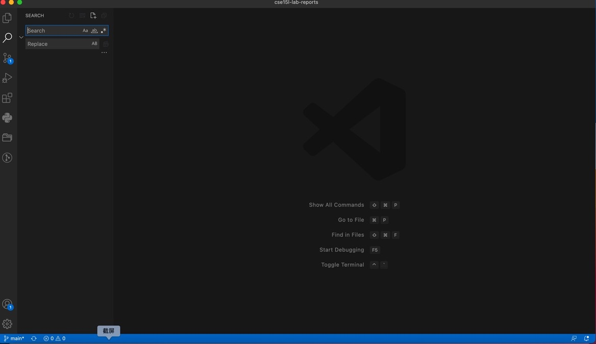
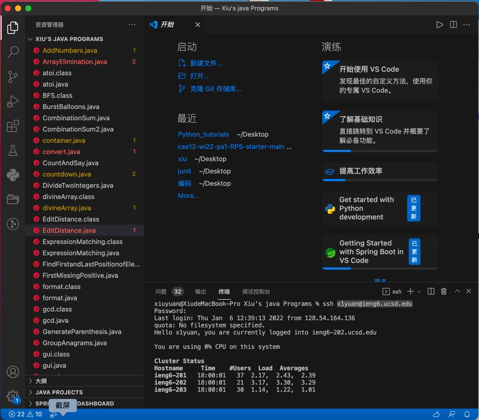
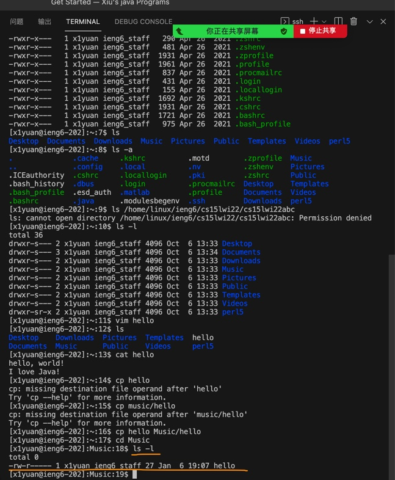
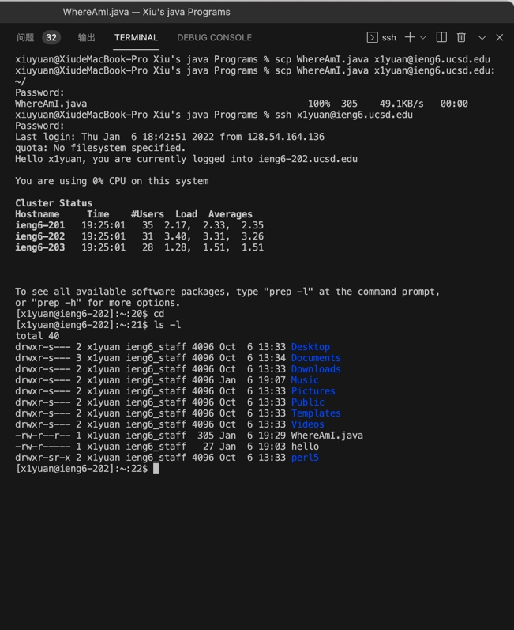
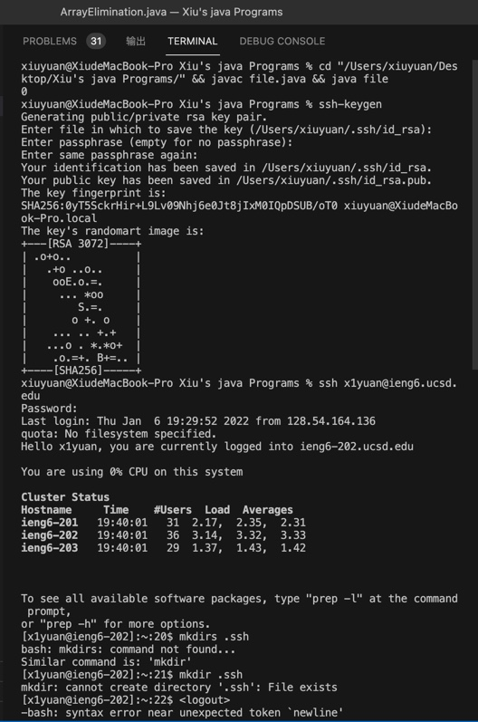

# Tutorials for CSE 15L Week 1 Lab
***Step 1: Installing Visual Studio Code***
>It is the very start of your extraoridinary journey in CSE 15L. Just go download VS Code in this 
[website][1]. After downloading VS Code, you will see this page below. 

[1]: https://code.visualstudio.com/

>Then you need to download Extension Pack in VS Code to dive into the wonderland of Java. 

------
***Step 2: Remotely Connecting***
>The second step is to connect to your account. If you are using Windows operating system, you have an extra thing to do: install
[OpenSSH][2]. Use your course-specific account: cs15lwi22zz@ieng6.ucsd.edu, zz is your account name in UCSD. 

[2]: https://docs.microsoft.com/en-us/windows-server/administration/openssh/openssh_install_firstuse
 
 >To remotely connect in VS Code, type the following command to your terminal: 
 
            $ssh cs15lwi22zz@ieng6.ucsd.edu
>Choose yes if you are asked yes or no. If nothing goes wrong, you will come to the page below.

------------
***Step 3: Trying some commands***
>Some commands you can try are listed below

command names|commands names|commands names
:-:|:-:|:-:
***cd***|***cat***|***pwd***
***ls -a***|***ls -lat***|***ls -l***
>The result of these commands is as follows:

--------
***Step 4: Moving files with scp command***
>scp is a command that copies a file from your computer to remote server. Create a file on your computer called WhereAmI.java and put the following code in it:

    class WhereAmI { 
        public static void main(String[] args) { System.out.println(System.getProperty(“os.name”)); System.out.println(System.getProperty(“user.name”)); System.out.println(System.getProperty(“user.home”)); System.out.println(System.getProperty(“user.dir”)); } }

>Then use the following command to copy the file into remote server:

    $scp WhereAmI.java cs15lwi22zz@ieng6.ucsd.edu:~/

>If you successfully finish it, you will see the following picture

>Then you can try to run the program on server by using javac and java command. 

----------
***Step 5: Setting an SSH key***
>To avoid typing your password every time you log into the server, you can use an SSH key to solve this. 

>This created two new files on your system; the private key (in a file id_rsa) and the public key (in a file id_rsa.pub), stored in the .ssh directory on your computer.Now we need to copy the public (not the private) key to the .ssh directory of your user account on the server.

    $ ssh cs15lwi22zz@ieng6.ucsd.edu
    <Enter Password>
    # now on server
    $ mkdir .ssh
    $ <logout>
    # back on client
    $ scp /Users/joe/.ssh/id_rsa.pub cs15lwi22@ieng6.ucsd.edu:~/.ssh/authorized_keys
    # You use your username and the path you saw in the command above

***Step 6: Making remote running even more pleasant***

 1. You can write a command in quotes at the end of an ssh command to directly run it on the remote server. 

        $ ssh cs15lwi22@ieng6.ucsd.edu "ls"
 2. You can use semicolons to run multiple commands on the same line in most terminals.

            $ cp WhereAmI.java OtherMain java; javac OtherMain.java; java WhereAmI
 3. You can use the up-arrow on your keyboard to recall the last command that was run